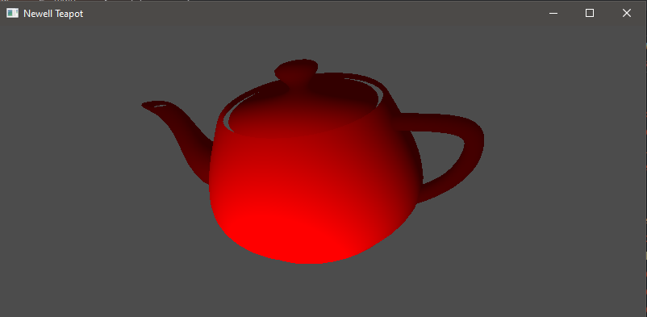
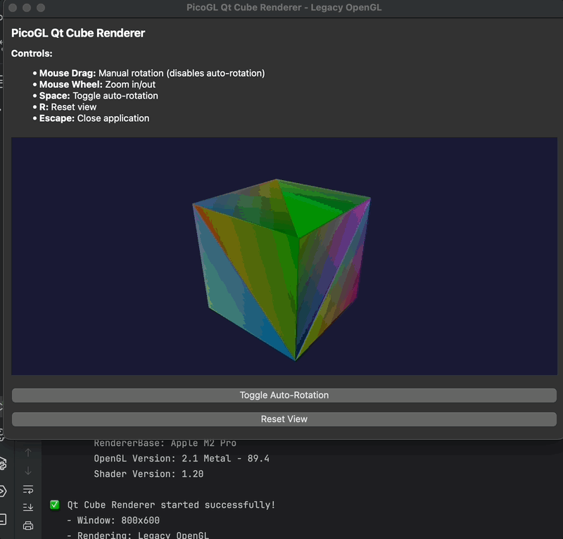
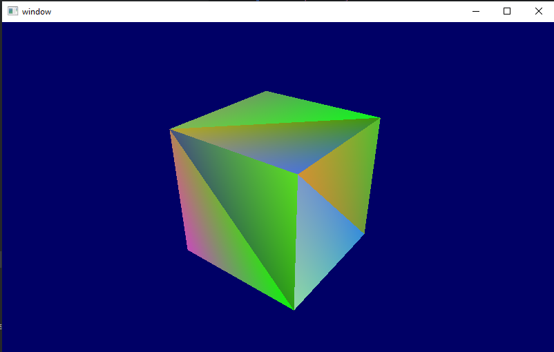
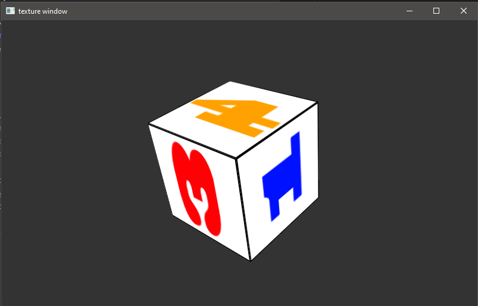
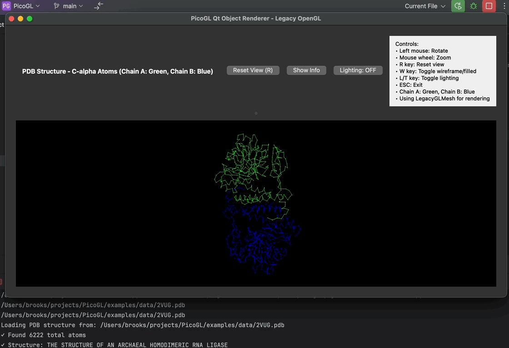

# 🦚 PicoGL

Peacock with goggles, geddit? 😊

**PicoGL** is a lightweight, Pythonic wrapper around Modern (and some Legacy) OpenGL — designed to make GPU programming simple, readable, and fun without sacrificing low-level control.

Whether you’re building interactive visualizations, scientific simulations, or games for fun, PicoGL gives you a clean, high-level API to work with shaders, buffers, and pipelines — while still letting you drop down to raw OpenGL when you need it.

---



## ✨ Features

- **Modern OpenGL API** — Focus on shader-based rendering without legacy cruft.
- **Simple, Pythonic interface** — Write less boilerplate, get more done.
- **Full low-level access** — No “black box” abstractions; raw OpenGL calls available anytime.
- **Resource management** — Automatic cleanup of buffers, shaders, and textures.
- **Cross-platform** — Works anywhere Python and OpenGL do.

---

## 🚀 Installation

```bash
    git clone https://github.com/markxbrooks/PicoGL.git
    cd PicoGL
    pip install .
```
or for an editable version:

```bash
    pip install -e .
```
PyPi version coming soon!

## 🖥️ No Shaders, No Problem!!
On MacOS, Modern OpenGL (With Vertex and Pixel Shaders) has been deprecated for a while.

Using the Legacy profile and Vertex Arrays (actually an equivalent called Vertex Buffer Groups in PicoGL) 
we can produce similar OpenGL applications with respectable performance.

```python see qt_cube.py
def initialize(self):
    if self._initialized:
        return
    self.mesh_data = MeshData.from_raw(
        vertices=self.vertices,
        colors=self.colors,
        indices=self.indices
    )
    self.gl_mesh_data = LegacyGLMesh.from_mesh_data(mesh=self.mesh_data)
    self.gl_mesh_data.upload()
    self._initialized = True
    log.message("✅ Qt Cube Renderer initialized")


def draw(self):
    """Draw the cube using LegacyGLMesh"""
    # Draw using LegacyGLMesh (already created and uploaded in initializeGL)
    if self.gl_mesh_data is not None:
        self.gl_mesh_data.draw()
```


# 📖 Documentation
Access PicoGL documentation in the format that works best for you:

## ℹ Available Formats:
### 📃 HTML Documentation:
Explore the full API reference, guides, and examples online:
https://markxbrooks.github.io/PicoGL/
### 📃 PDF Documentation:
Download a convenient PDF version for offline reading or printing:
⬇ https://github.com/markxbrooks/PicoGL/blob/main/doc/_build/latex/picogl.pdf
### 📃 Local Documentation:
The Docs directory within this repository contains the source files and additional reference materials for offline access or custom builds.
Whether you prefer browsing online, reading offline, or exploring the raw documentation files, PicoGL’s documentation provides comprehensive guidance for using the library effectively.

## 🎲  Example usage to show a cube:
Found in the Examples directory, with mouse control




```python
"""Minimal PicoGL Cube. Compare to tu_01_color_cube.py"""

from pathlib import Path
from typing import NoReturn
from examples.data.cube_data import g_color_buffer_data, g_vertex_buffer_data
from picogl.renderer import MeshData
from picogl.ui.backend.glut.window.object import RenderWindow

GLSL_DIR = Path(__file__).parent / "glsl" / "tu01"


def main() -> NoReturn:
    """Set up the colored object dat and show it"""
    data = MeshData.from_raw(vertices=g_vertex_buffer_data, colors=g_color_buffer_data)
    render_window = RenderWindow(
        width=800, height=600, title="Cube window", data=data, glsl_dir=GLSL_DIR
    )
    render_window.initialize()
    render_window.run()


if __name__ == "__main__":
    main()

```
### 🎨With a corresponding renderer

```python
from OpenGL.raw.GL.VERSION.GL_1_0 import GL_TRIANGLES

from picogl.backend.modern.core.vertex.array.object import VertexArrayObject
from picogl.renderer import GLContext, MeshData, RendererBase


class ObjectRenderer(RendererBase):
    """ Basic renderer class """

    def __init__(self,
                 context: GLContext,
                 data: MeshData,
                 glsl_dir: str):
        super().__init__()
        self.context, self.data = context, data
        self.glsl_dir = glsl_dir
        self.show_model = True

    def initialize_shaders(self):
        """Load and compile shaders."""
        self.context.create_shader_program(vertex_source_file="vertex.glsl",
                                           fragment_source_file="fragment.glsl",
                                           glsl_dir=self.glsl_dir)

    def initialize_buffers(self):
        """Create VAO and VBOs once."""
        if self.context.vaos is None:
            self.context.vaos = {}
        self.context.vaos["cube"] = cube_vao = VertexArrayObject()
        cube_vao.add_vbo(index=0, data=self.data.vbo, size=3)
        cube_vao.add_vbo(index=1, data=self.data.cbo, size=3)
        if self.data.nbo is not None:
            cube_vao.add_vbo(index=2, data=self.data.nbo, size=3)

    def render(self) -> None:
        """
        render dispatcher
        :return: None
        """
        if self.show_model:
            self._draw_model()
        # Add more conditions and corresponding draw functions as needed
        self._finalize_render()

    def _draw_model(self):
        """Draw the model_matrix"""
        cube_vao = self.context.vaos["cube"]
        shader = self.context.shader
        with shader, cube_vao:
            shader.uniform("mvp_matrix", self.context.mvp_matrix)
            shader.uniform("model_matrix", self.context.model_matrix)
            cube_vao.draw(mode=GL_TRIANGLES, index_count=self.data.vertex_count)

```
## ␨ Textured object


```python
"""
Demonstrating textures - compare to tu02_texture_without_normal.py
"""

from pathlib import Path
from typing import NoReturn

from examples import g_vertex_buffer_data, g_uv_buffer_data
from picogl.renderer import MeshData
from picogl.ui.backend.glut.window.texture import TextureWindow

BASE_DIR = Path(__file__).resolve().parent
GLSL_DIR = BASE_DIR / "glsl" / "tu02"


def main() -> NoReturn:
    """Set up the cube and draw it with texture."""
    cube_data = MeshData.from_raw(vertices=g_vertex_buffer_data, uvs=g_uv_buffer_data)
    render_window = TextureWindow(
        width=800,
        height=600,
        title="texture window",
        data=cube_data,
        base_dir=BASE_DIR,
        glsl_dir=GLSL_DIR,
    )
    render_window.initialize()
    render_window.run()


if __name__ == "__main__":
    main()
```

## 🫖 Teapot object


```python
"""Minimal PicoGL Teapot."""

from pathlib import Path

from picogl.renderer import MeshData
from picogl.ui.backend.glut.window.object import RenderWindow
from picogl.utils.loader.object import ObjectLoader

GLSL_DIR = Path(__file__).parent / "glsl" / "teapot"


def main():
    """Set up the teapot object and show it."""
    object_file_name = "data/teapot.obj"
    obj_loader = ObjectLoader(object_file_name)
    teapot_data = obj_loader.to_array_style()
    data = MeshData.from_raw(
        vertices=teapot_data.vertices,
        normals=teapot_data.normals,
        colors=([[1.0, 0.0, 0.0]] * (len(teapot_data.vertices) // 3))
    )
    render_window = RenderWindow(
        width=800,
        height=600,
        title="Newell Teapot",
        glsl_dir=GLSL_DIR,
        data=data,
    )
    render_window.initialize()
    render_window.run()


if __name__ == "__main__":
    """Run the main function."""
    main()
```


## ⚛ Protein Molecule 

🎓Training wheels off now...



qt_legacy_glmesh_molecular_viewer.py
```python
    def _load_pdb_structure(self):
        """Load PDB structure and extract C-alpha atoms"""
        print(f"Loading PDB structure from: {self.pdb_path}")

        try:
            self.pdb_loader = PDBLoader(self.pdb_path)
            structure = self.pdb_loader.structure

            print(f"✓ Found {len(structure.atoms)} total atoms")
            print(f"✓ Structure: {structure.title}")
            print(f"✓ Chains: {structure.chains}")
            print(f"✓ Residues: {len(structure.residues)}")

            # Extract C-alpha atoms
            self.calpha_atoms = [atom for atom in structure.atoms if atom.name == "CA"]
            print(f"✓ Found {len(self.calpha_atoms)} C-alpha atoms")

            # Generate C-alpha bonds (sequential bonds within each chain)
            self.calpha_bonds = self._generate_calpha_bonds()
            print(f"✓ Generated {len(self.calpha_bonds)} C-alpha bonds")

            # Note: Mesh data will be created in initializeGL when OpenGL context is ready

        except Exception as e:
            print(f"Error loading PDB file: {e}")
            QMessageBox.critical(None, "Error", f"Failed to load PDB file: {e}")

    def _generate_calpha_bonds(self):
        """Generate bonds between consecutive C-alpha atoms in the same chain"""
        bonds = []

        # Group atoms by chain
        chain_atoms = {}
        for atom in self.calpha_atoms:
            if atom.chain_id not in chain_atoms:
                chain_atoms[atom.chain_id] = []
            chain_atoms[atom.chain_id].append(atom)

        # Create bonds within each chain
        for chain_id, atoms in chain_atoms.items():
            # Sort atoms by residue number
            atoms.sort(key=lambda a: a.res_seq)

            # Create bonds between consecutive atoms
            for i in range(len(atoms) - 1):
                bonds.append((atoms[i], atoms[i + 1]))

        return bonds

    def _create_mesh_data(self):
        """Create MeshData for atoms and bonds using PicoGL"""
        # Create sphere mesh data for atoms
        if self._initialized:
            return
        atom_vertices, atom_normals, atom_colors_rgba, atom_indices = self._create_sphere_mesh_data()

        # Create line mesh data for bonds
        bond_vertices, bond_colors, bond_indices = self._create_bond_mesh_data()
        # Convert RGBA colors to RGB for LegacyGLMesh
        atom_colors_rgb = atom_colors_rgba[:, :3]  # Remove alpha channel
        mesh_data = MeshData.from_raw(vertices=atom_vertices,
                                      indices=atom_indices,
                                      colors=atom_colors_rgb)

        # Create atoms mesh
        if atom_vertices is not None:
            self.atoms_mesh = LegacyGLMesh.from_mesh_data(mesh_data)
            self.atoms_mesh.upload()

        # Create bonds mesh
        if bond_vertices is not None:
            # Convert RGBA colors to RGB for LegacyGLMesh
            bond_colors_rgb = bond_colors[:, :3]  # Remove alpha channel
            self.bonds_mesh = LegacyGLMesh(
                vertices=bond_vertices,
                faces=bond_indices,
                colors=bond_colors_rgb
            )
            self.bonds_mesh.upload()
```

# 🔔 What this is not!
After writing the code and naming it PicoGL, we realize there is a Javascript Library called PicoGL.js
 - It looks similar in ethos to this Python version
 - It looks vaguely similar to this Python syntactically
 - The existence of both could help porting Python to WebGL and vice-versa

Let's compare setting up a Vertex Array Object (VAO) containing positions and normals in both languages:

### 'Raw' WebGL
```javascript
      vertexArray = gl.createBuffer(1)
      gl.bindVertexArray(vertexArray);
      gl.bindBuffer(gl.ARRAY_BUFFER, positionBuffer);
      gl.vertexAttribPointer(0, 3, gl.FLOAT, false, 0, 0);
      gl.enableVertexAttribArray(0);
      
      gl.bindBuffer(gl.ARRAY_BUFFER, normalBuffer);
      gl.vertexAttribPointer(1, 3, gl.FLOAT, false, 0, 0);
      gl.enableVertexAttribArray(1);  
      gl.bindVertexArray(null);
```

### PicoGL.js
```javascript
      var vertexArray = app.createVertexArray()
      .vertexAttributeBuffer(0, positionBuffer)
      .vertexAttributeBuffer(1, normalBuffer);
```
Taken from: https://tsherif.github.io/khronos-meetup-picogl/#/7

### Python 🐍 'raw' Open GL
```python
    vertex_array = GL.glGenVertexArrays(1)
    GL.glBindVertexArray(vertex_array)
    
    GL.glBindBuffer(GL_ARRAY_BUFFER, position_buffer)
    GL.glVertexAttribPointer(0, 3, GL.GL_FLOAT, GL.GL_FALSE, 0, None)
    GL.glEnableVertexAttribArray(0)
    
    GL.glBindBuffer(GL.GL_ARRAY_BUFFER, normal_buffer)
    GL.glVertexAttribPointer(1, 3, GL.GL_FLOAT, GL.GL_FALSE, 0, None)
    GL.glEnableVertexAttribArray(1)
    
    GL.glBindVertexArray(0)
```

### PicoGL for Python 🐍
```python
    vertex_array = VertexArrayObject()
    vertex_array.add_vbo(index=0, data=position_buffer, size=3)
    vertex_array.add_vbo(index=1, data=normal_buffer, size=3)
```