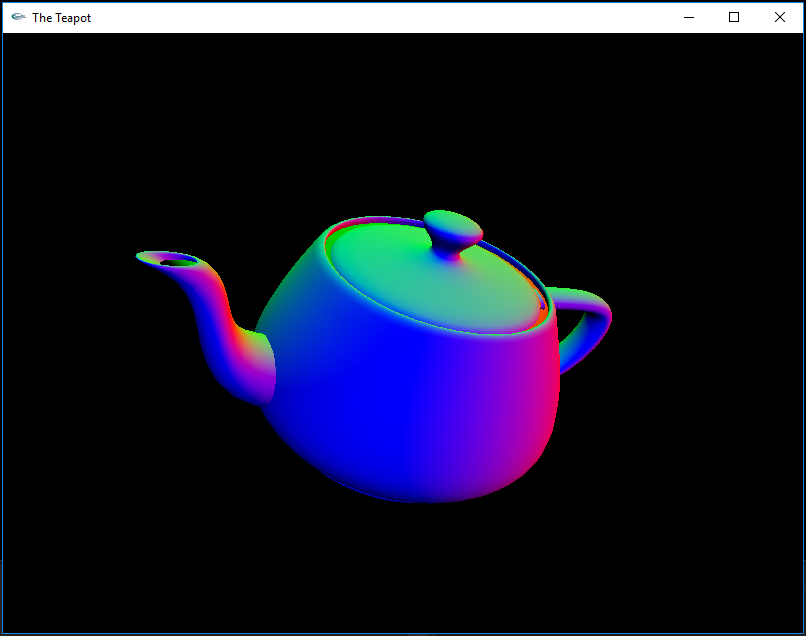

# PicoGL

**PicoGL** is a lightweight, Pythonic wrapper around Modern (and some Legacy) OpenGL — designed to make GPU programming simple, readable, and fun without sacrificing low-level control.

Whether you’re building interactive visualizations, scientific simulations, or games for fun, PicoGL gives you a clean, high-level API to work with shaders, buffers, and pipelines — while still letting you drop down to raw OpenGL when you need it.

---



## ✨ Features

- **Modern OpenGL API** — Focus on shader-based rendering without legacy cruft.
- **Simple, Pythonic interface** — Write less boilerplate, get more done.
- **Full low-level access** — No “black box” abstractions; raw OpenGL calls available anytime.
- **Resource management** — Automatic cleanup of buffers, shaders, and textures.
- **Cross-platform** — Works anywhere Python and OpenGL do.

---

## 🚀 Installation

```bash
    pip install picogl
```
or for an editable version:

```bash
    pip install -e picogl
```

##  U+1FAD6 Example usage:

```python
teapot_vao = VertexArrayObject()
vbo = teapot_vao.add_vbo(index=0, data=positions, size=3, name="vbo")  # Position VBO
cbo = teapot_vao.add_vbo(index=1, data=colors, size=3, name="cbo")  # Color VBO
nbo = teapot_vao.add_vbo(index=2, data=normals, size=3, name="nbo")  # Normals VBO
teapot_vao.draw(index_count=teapot_indices)
```
