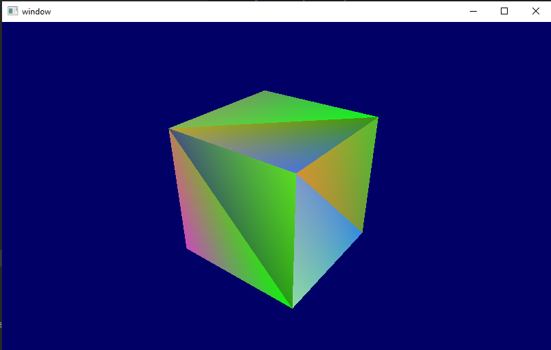

# PicoGL

**PicoGL** is a lightweight, Pythonic wrapper around Modern (and some Legacy) OpenGL — designed to make GPU programming simple, readable, and fun without sacrificing low-level control.

Whether you’re building interactive visualizations, scientific simulations, or high-performance games, picogl gives you a clean, high-level API to work with shaders, buffers, and pipelines — while still letting you drop down to raw OpenGL when you need it.

---


## ✨ Features

- **Modern OpenGL API** — Focus on shader-based rendering without legacy cruft.
- **Simple, Pythonic interface** — Write less boilerplate, get more done.
- **Full low-level access** — No “black box” abstractions; raw OpenGL calls available anytime.
- **Resource management** — Automatic cleanup of buffers, shaders, and textures.
- **Cross-platform** — Works anywhere Python and OpenGL do.

---

## 🚀 Installation

```bash
    pip install picogl
```
or for an editable version:

```bash
    pip install -e picogl
```

##  Example usage to show a cube:
Found in the Examples directory, with mouse control




```python
"""Minimal PicoGL Cube. Compare to tu_01_color_cube.py"""
import os
from picogl.renderer import GLContext, GLData
from picogl.utils.reshape import float32_row
from examples.object_renderer import ObjectRenderer
from examples.picogl_window import PicoGLWindow
from examples.data import g_vertex_buffer_data, g_color_buffer_data
GLSL_DIR = os.path.join(os.path.dirname(__file__), "glsl", "tu01")

class CubeWindow(PicoGLWindow):
    def __init__(self, width, height, *args, **kwargs):
        super().__init__(width, height, *args, **kwargs)
        self.context = GLContext()
        self.data = GLData(
            positions=float32_row(g_vertex_buffer_data),
            colors=float32_row(g_color_buffer_data),
        )
        self.renderer = ObjectRenderer(
            context=self.context,
            data=self.data,
            base_dir=GLSL_DIR
        )
        self.renderer.show_model = True  # set here whether to show the cube

win = CubeWindow(width=800, height=600)
win.initializeGL()
win.run()
```
*With a corresponding renderer

```python
from OpenGL.raw.GL.VERSION.GL_1_0 import GL_TRIANGLES

from picogl.renderer import RendererBase, GLContext, GLData
from picogl.backend.modern.core.vertex.array.object import VertexArrayObject


class ObjectRenderer(RendererBase):
    """ Basic renderer class """

    def __init__(self,
                 context: GLContext,
                 data: GLData,
                 base_dir: str):
        super().__init__()
        self.context, self.data = context, data
        self.base_dir = base_dir
        self.show_model = True

    def initialize_shaders(self):
        """Load and compile shaders."""
        from picogl.backend.modern.core.shader.program import PicoGLShader
        self.context.shader = PicoGLShader(vertex_source_file="vertex.glsl",
                                           fragment_source_file="fragment.glsl",
                                           base_dir=self.base_dir)

    def initialize_buffers(self):
        """Create VAO and VBOs once."""
        self.context.vertex_array = cube_vao = VertexArrayObject()
        cube_vao.add_vbo(index=0, data=self.data.positions, size=3)
        cube_vao.add_vbo(index=1, data=self.data.colors, size=3)

    def render(self) -> None:
        """
        render dispatcher
        :return: None
        """
        if self.show_model:
            self._draw_model()
        # Add more conditions and corresponding draw functions as needed
        self._finalize_render()

    def _draw_model(self):
        """Draw the model"""
        with self.context.shader, self.context.vertex_array:
            self.context.shader.uniform("mvp_matrix", self.context.mvp_matrix)
            self.context.vertex_array.draw(mode=GL_TRIANGLES, index_count=self.data.vertex_count)

```
